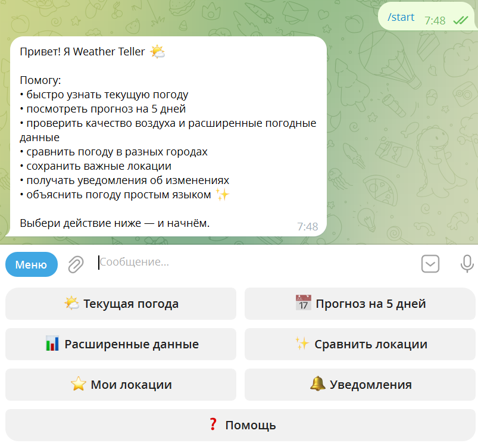
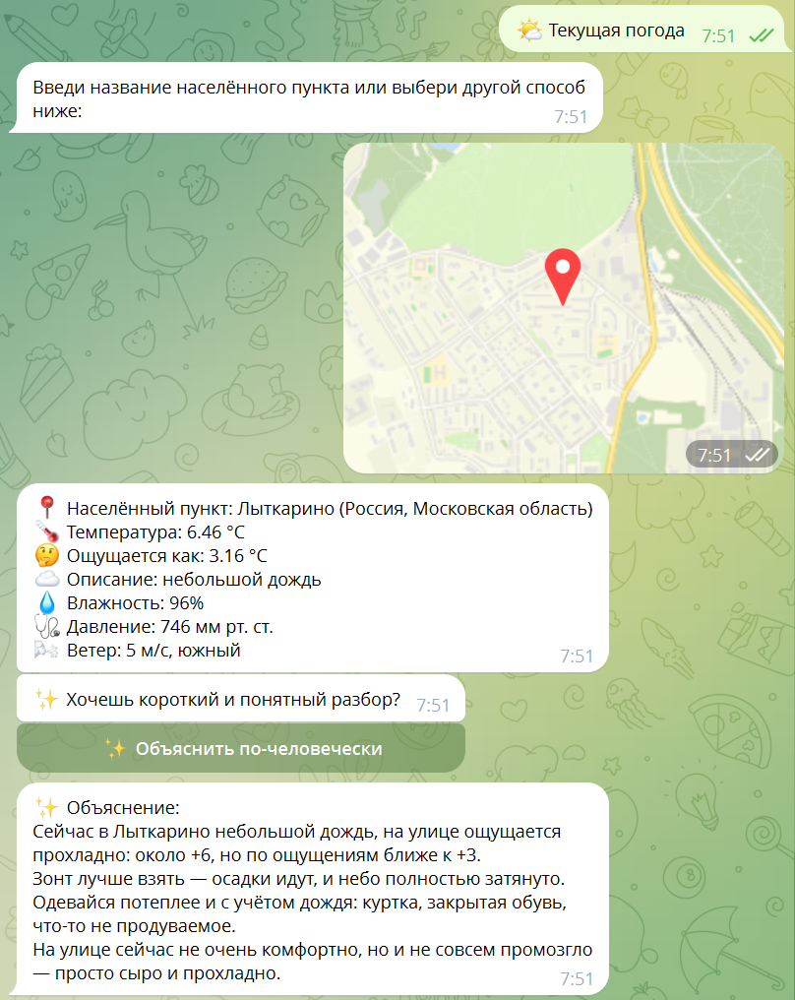
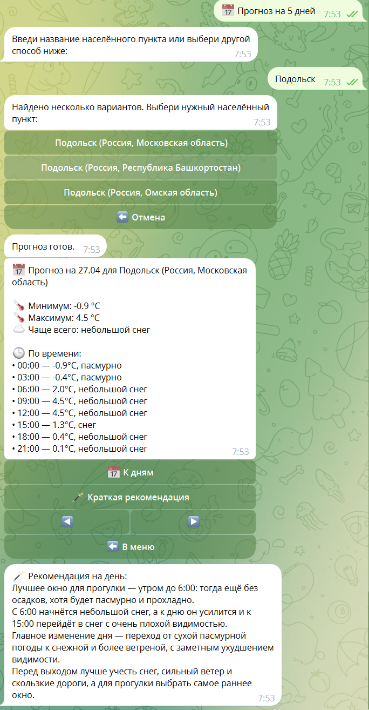
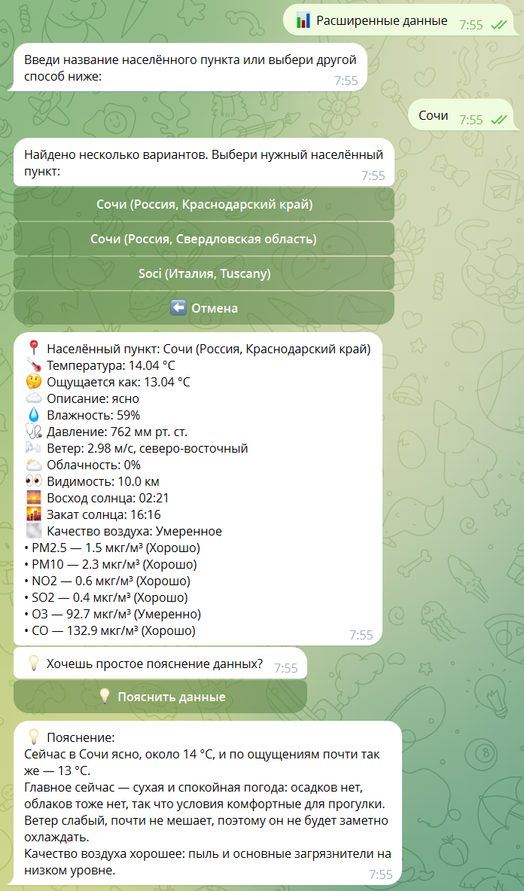
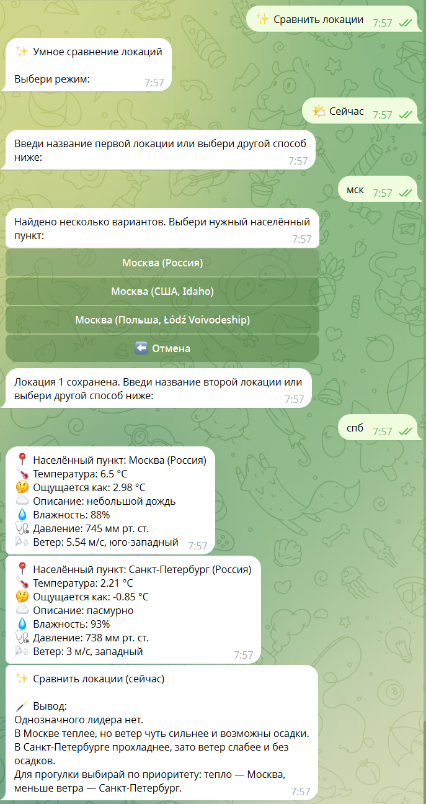
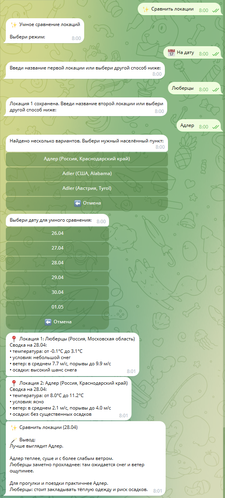
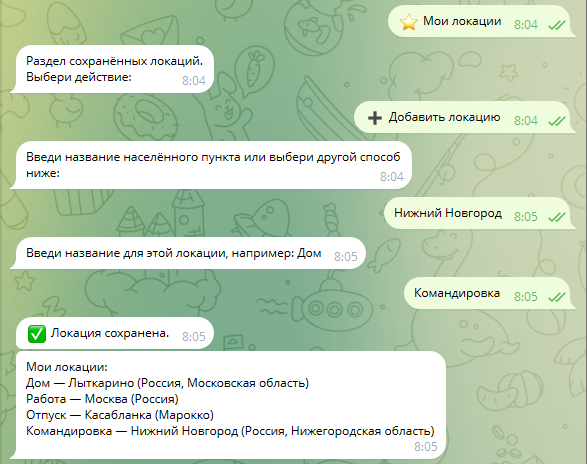
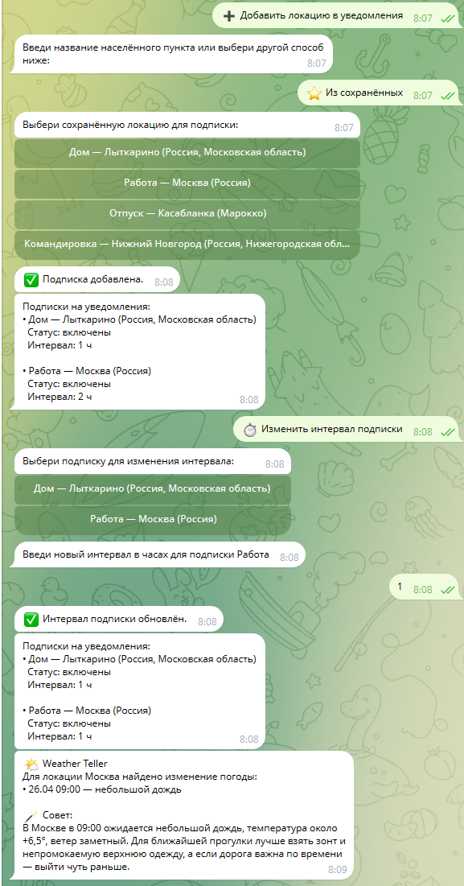
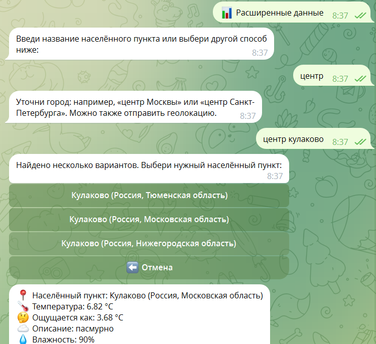

# Weather Teller Telegram Bot

## English summary

Weather Teller is a Telegram weather bot built with Python, PostgreSQL, Docker, OpenWeather API and OpenAI API.  
It provides current weather, 5-day forecasts, extended weather metrics, air quality data, smart location comparison, saved locations and multi-location alerts.  
The project includes AI-powered explanations, weather alert advice, location query assistance and short TTL API caching.  
The bot is designed as a portfolio-ready educational project with a production-like Docker Compose setup.  
It runs both locally and in Docker Compose with PostgreSQL as the primary storage.

## Описание проекта

Weather Teller — Telegram-бот для получения погоды, мониторинга изменений, сравнения локаций и хранения часто используемых мест.

## Основные возможности

### Погода

- текущая погода;
- прогноз на 5 дней;
- расширенные данные;
- качество воздуха;
- ввод локации текстом, координатами, геолокацией или через сохранённые локации.

### Локации

- сохранение часто используемых локаций;
- добавление через город, координаты или геолокацию;
- переименование и удаление;
- защита от дублей;
- выбор сохранённых локаций в погоде, прогнозе, расширенных данных, уведомлениях и сравнении;
- обработка неоднозначных запросов:
  - Питер / СПб;
  - мск;
  - центр;
  - центр Москвы;
  - центр Кулаково;
  - Кулаково Раменское.

### Сравнение локаций

- режим «Сейчас»;
- режим «На дату»;
- выбор каждой из двух локаций любым способом;
- защита от сравнения одной и той же точки;
- короткий понятный вывод по погодным условиям;
- deterministic verdicts для более стабильных формулировок.

### Уведомления

- подписки по нескольким локациям;
- настройка интервала;
- включение/выключение;
- удаление подписки;
- AI-совет в уведомлении;
- уведомления показывают фактический населённый пункт, а не только пользовательское название.

### AI-функции

- объяснение текущей погоды простым языком;
- объяснение расширенных данных и качества воздуха;
- рекомендация по прогнозу дня;
- совет в уведомлениях;
- помощь при неоднозначном вводе локации;
- fallback-режим, если OpenAI API недоступен.

### Кэширование

- short TTL in-memory API-cache для OpenWeather:
  - current weather;
  - forecast;
  - air pollution;
  - geocoding;
  - reverse geocoding;
- PostgreSQL AI-cache для AI-ответов;
- cache hit/miss logging.

## Стек

- Python
- pyTelegramBotAPI
- OpenWeather API
- OpenAI API
- PostgreSQL
- Docker / Docker Compose
- psycopg v3
- python-dotenv

## Структура проекта

```text
bot.py
flows.py
handlers/
weather/
ai_weather_service.py
postgres_storage.py
alerts_subscription_service.py
app_context.py
session_store.py
formatters.py
keyboards.py
Dockerfile
docker-compose.yml
docker-compose.postgres.yml
.env.example
.env.docker.example
```

- `bot.py` — точка входа, регистрация обработчиков, запуск polling и фонового worker.
- `flows.py` — сценарные flow-функции и логика оркестрации уведомлений.
- `handlers/` — текстовые и callback-обработчики по сценариям.
- `weather/` — модуль OpenWeather API, геокодинг, reverse geocoding, API-cache.
- `ai_weather_service.py` — AI-объяснения, AI-assist, deterministic fallback и AI-cache интеграция.
- `postgres_storage.py` — слой хранения данных в PostgreSQL.
- `alerts_subscription_service.py` — доменная логика подписок уведомлений.
- `app_context.py` — контейнер зависимостей приложения.
- `session_store.py` — runtime-состояния и FSM-данные.
- `formatters.py` — форматирование пользовательских сообщений.
- `keyboards.py` — reply/inline клавиатуры.

## Переменные окружения

Пример (`.env`):

```env
BOT_TOKEN=your_telegram_token
OW_API_KEY=your_openweather_key
PGHOST=localhost
PGPORT=5432
PGDATABASE=weather_teller
PGUSER=weather_user
PGPASSWORD=change_me_strong_password
OPENAI_API_KEY=
OPENAI_MODEL=your_openai_model
```

Важно:

- для локального запуска вне Docker обычно `PGHOST=localhost`;
- для запуска в Docker Compose (когда бот в контейнере) должен быть `PGHOST=postgres`;
- `OPENAI_API_KEY` опционален;
- `OPENAI_MODEL` опционален;
- если `OPENAI_API_KEY` не задан, основные погодные сценарии не падают и работают через fallback.

## Локальный запуск

### 1) Создать и активировать виртуальное окружение

```bash
python -m venv venv
```

Windows PowerShell:

```powershell
venv\Scripts\Activate.ps1
```

Windows CMD:

```cmd
venv\Scripts\activate.bat
```

### 2) Установить зависимости

```bash
pip install -r requirements.txt
```

### 3) Подготовить `.env`

```bash
cp .env.example .env
```

Windows PowerShell:

```powershell
Copy-Item .env.example .env
```

Заполни реальные значения `BOT_TOKEN`, `OW_API_KEY`, `PGPASSWORD`.

### 4) При необходимости поднять PostgreSQL

Если PostgreSQL не запущен локально отдельно, подними его через Docker (см. раздел ниже).

### 5) Запустить бота

```bash
python bot.py
```

## Запуск PostgreSQL в Docker

Этот режим поднимает только базу, бот запускается локально из Python.

Запуск:

```bash
docker compose -f docker-compose.postgres.yml up -d
```

Остановка:

```bash
docker compose -f docker-compose.postgres.yml down
```

## Запуск всего проекта в Docker Compose

Этот режим поднимает оба сервиса: `postgres` и `weather_bot`.  
Проект использует production-like Docker Compose setup: healthcheck PostgreSQL, запуск бота после `service_healthy`, и дополнительную retry-логику подключения к БД в приложении.

### 1) Подготовить docker-совместимый `.env`

```bash
cp .env.docker.example .env
```

Windows PowerShell:

```powershell
Copy-Item .env.docker.example .env
```

Заполни реальные `BOT_TOKEN`, `OW_API_KEY`, `PGPASSWORD`.

Важно: для этого режима внутри `.env` должен быть `PGHOST=postgres`.

### 2) Запуск полного стека

```bash
docker compose up -d --build
```

### 3) Остановка

```bash
docker compose down
```

## Просмотр таблиц PostgreSQL в Docker

Вход в `psql` с отключённым пейджером:

```bash
docker exec -it weather_postgres psql -U weather_user -d weather_teller -P pager=off
```

Список таблиц:

```sql
\dt
```

Просмотр данных:

```sql
SELECT * FROM users;
SELECT * FROM saved_locations;
SELECT * FROM alert_subscriptions;
SELECT * FROM ai_response_cache;
```

Выход:

```sql
\q
```

## Что хранится в базе

- `users` — служебные пользовательские настройки и последняя рабочая локация.
- `saved_locations` — пользовательские сохранённые локации.
- `alert_subscriptions` — подписки уведомлений по нескольким локациям (статус, интервал, служебные поля worker).
- `ai_response_cache` — кэш AI-ответов в PostgreSQL.

## Команды бота

- `/start` — главное меню
- `/current` — текущая погода
- `/forecast` — прогноз на 5 дней
- `/details` — расширенные данные
- `/alerts` — уведомления
- `/compare` — сравнение локаций
- `/geo` — погода по геолокации
- `/help` — справка

Основной UX реализован через кнопочное меню, а команды сохранены как shortcuts/backward compatibility.

## Скриншоты

### Главное меню


### Текущая погода и AI-пояснение


### Прогноз на 5 дней


### Расширенные данные и AI-пояснение


### Сравнение локаций сейчас


### Сравнение локаций на дату


### Сохранённые локации


### Уведомление с AI-советом


### Уточнение неоднозначной локации


## Текущий статус проекта

- v1 feature-complete;
- протестирован локально и в Docker Compose;
- поддерживает серверный деплой;
- далее запланированы архитектурный рефакторинг и расширение тестового покрытия.

## Future improvements / Roadmap

- split `ai_weather_service.py` into prompts/fallbacks/signatures modules;
- extract shared location input pipeline;
- move notifications worker into dedicated service;
- add tests for critical state transitions;
- improve observability;
- optional multilingual mode.

## Автор

Автор: Елена Шленскова  
Telegram: @elena_shlenskova
