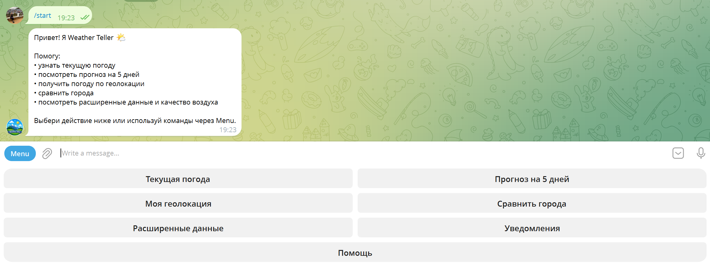
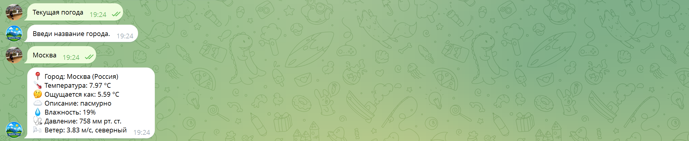
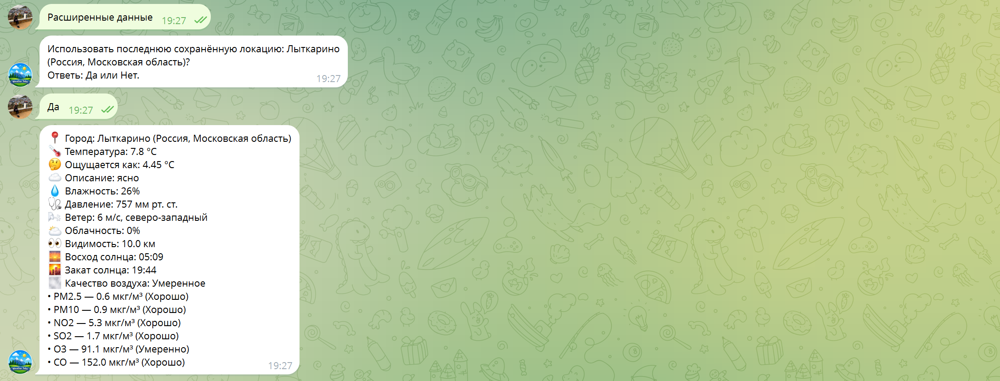
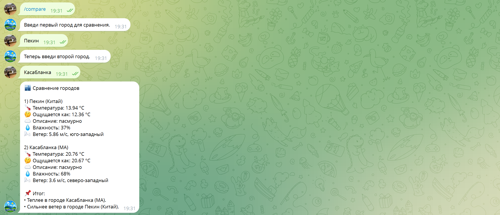
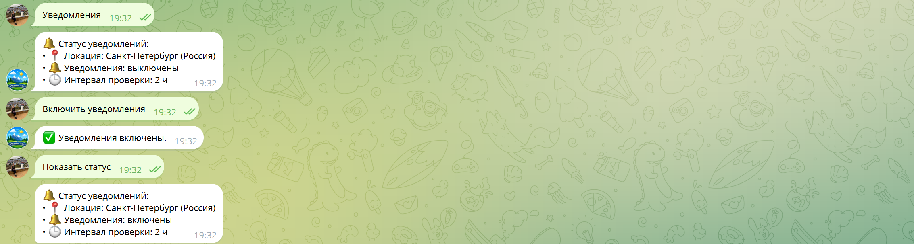

# Weather Teller Telegram Bot

Weather Teller is a Telegram weather bot built with Python and OpenWeather API.  
It provides current weather, 5-day forecast, geolocation weather, detailed metrics, air quality, and city comparison.  
The bot supports saved/favorite locations, multi-location alert subscriptions, and manual coordinate input.  
Current architecture uses PostgreSQL as the main storage and is ready for Docker-based local/server deployment.  
The project can run both as local Python app and as a full Docker Compose stack.

## Описание проекта

Weather Teller — Telegram-бот для получения и мониторинга погоды.

Актуальная версия поддерживает:

- текущую погоду;
- прогноз на 5 дней;
- погоду по геолокации;
- расширенные данные и качество воздуха;
- сравнение населённых пунктов;
- сохранённые локации и выбор основной локации;
- уведомления по нескольким локациям;
- ручной ввод координат;
- хранение данных в PostgreSQL;
- запуск в Docker / Docker Compose.

## Функциональность

- **Текущая погода**: поиск по населённому пункту, выбор из нескольких совпадений, использование основной локации.
- **Прогноз на 5 дней**: группировка по дням, удобная inline-навигация.
- **Погода по геолокации**: получение погоды по отправленной точке.
- **Расширенные данные**: влажность, давление, ветер, облачность, видимость, восход/закат, качество воздуха.
- **Сравнение населённых пунктов**: параллельный вывод погоды для двух локаций.
- **Сохранённые локации**: добавление, переименование, удаление, просмотр списка.
- **Основная локация**: быстрый выбор любимой локации в сценариях погоды/прогноза/деталей.
- **Уведомления по нескольким локациям**: подписки с интервалом проверки, включение/выключение, удаление.
- **Ввод координат вручную**: поддержка форматов `lat, lon` и `lat lon`.

## Стек

- Python
- pyTelegramBotAPI
- OpenWeather API
- PostgreSQL
- Docker / Docker Compose
- python-dotenv
- psycopg v3 (`psycopg[binary]`)

## Структура проекта

Ниже ключевые файлы и модули текущей архитектуры:

```text
bot.py
postgres_storage.py
alerts_subscription_service.py
app_context.py
session_store.py
flows.py
handlers/
weather/
formatters.py
keyboards.py
docker-compose.yml
docker-compose.postgres.yml
Dockerfile
.env.example
.env.docker.example
```

- `bot.py` — точка входа, регистрация обработчиков, запуск polling и worker.
- `postgres_storage.py` — слой хранения в PostgreSQL.
- `alerts_subscription_service.py` — доменная логика подписок на уведомления.
- `app_context.py` — DI-контейнер зависимостей.
- `session_store.py` — runtime-состояния и FSM-данные.
- `flows.py` — сценарные flow-функции и `alerts_worker`.
- `handlers/` — текстовые и callback-обработчики по сценариям.
- `weather/` — модули API/локаций/качества воздуха.
- `docker-compose.yml` — полный запуск (`postgres + weather_bot`).
- `docker-compose.postgres.yml` — запуск только PostgreSQL.

## Переменные окружения

Пример (`.env`):

```env
BOT_TOKEN=your_telegram_token
OW_API_KEY=your_openweather_key
PGHOST=localhost
PGPORT=5432
PGDATABASE=weather_teller
PGUSER=weather_user
PGPASSWORD=change_me_strong_password
```

Важно:

- для локального запуска вне Docker обычно `PGHOST=localhost`;
- для запуска в Docker Compose (когда бот в контейнере) должен быть `PGHOST=postgres`.

## Локальный запуск

### 1) Создать и активировать виртуальное окружение

```bash
python -m venv venv
```

Windows PowerShell:

```powershell
venv\Scripts\Activate.ps1
```

Windows CMD:

```cmd
venv\Scripts\activate.bat
```

### 2) Установить зависимости

```bash
pip install -r requirements.txt
```

### 3) Подготовить `.env`

```bash
cp .env.example .env
```

Windows PowerShell:

```powershell
Copy-Item .env.example .env
```

Заполни реальные значения `BOT_TOKEN`, `OW_API_KEY`, `PGPASSWORD`.

### 4) При необходимости поднять PostgreSQL

Если PostgreSQL не запущен локально отдельно, подними его через Docker (см. раздел ниже).

### 5) Запустить бота

```bash
python bot.py
```

## Запуск PostgreSQL в Docker

Этот режим поднимает только базу, бот запускается локально из Python.

Запуск:

```bash
docker compose -f docker-compose.postgres.yml up -d
```

Остановка:

```bash
docker compose -f docker-compose.postgres.yml down
```

## Запуск всего проекта в Docker

Этот режим поднимает оба сервиса: `postgres` и `weather_bot`.

### 1) Подготовить docker-совместимый `.env`

```bash
cp .env.docker.example .env
```

Windows PowerShell:

```powershell
Copy-Item .env.docker.example .env
```

Заполни реальные `BOT_TOKEN`, `OW_API_KEY`, `PGPASSWORD`.

Важно: для этого режима внутри `.env` должен быть `PGHOST=postgres`.

### 2) Запуск полного стека

```bash
docker compose up -d --build
```

### 3) Остановка

```bash
docker compose down
```

## Просмотр таблиц PostgreSQL в Docker

Вход в `psql` с отключённым пейджером:

```bash
docker exec -it weather_postgres psql -U weather_user -d weather_teller -P pager=off
```

Список таблиц:

```sql
\dt
```

Просмотр данных:

```sql
SELECT * FROM users;
SELECT * FROM saved_locations;
SELECT * FROM alert_subscriptions;
```

Выход:

```sql
\q
```

## Что хранится в базе

- `users` — активная локация пользователя, выбранная основная локация, legacy-настройки уведомлений.
- `saved_locations` — пользовательские сохранённые локации.
- `alert_subscriptions` — подписки уведомлений по нескольким локациям (статус, интервал, служебные поля worker).

## Команды бота

- `/start` — главное меню
- `/current` — текущая погода
- `/forecast` — прогноз на 5 дней
- `/geo` — погода по геолокации
- `/compare` — сравнение двух населённых пунктов
- `/details` — расширенные данные
- `/alerts` — уведомления
- `/help` — справка

## Текущий статус проекта

- Базовая версия бота готова и работает в production-подобной структуре.
- PostgreSQL и Docker уже подключены в рабочем контуре.
- Следующий этап — деплой на Ubuntu-сервер и дальнейшее развитие функциональности.

## Скриншоты

### Главное меню



### Текущая погода



### Геолокация


### Расширенные данные



### Сравнение городов



### Уведомления


