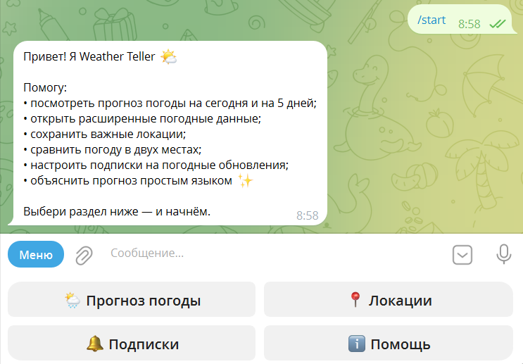
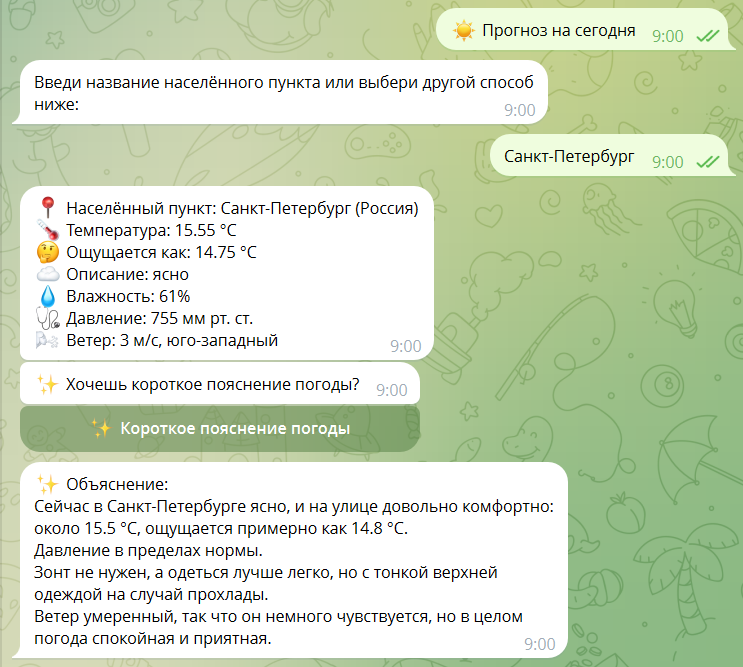
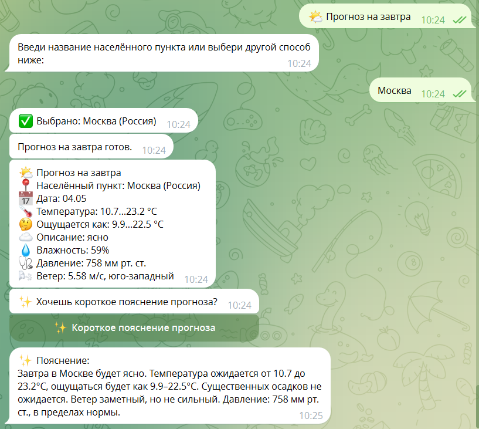
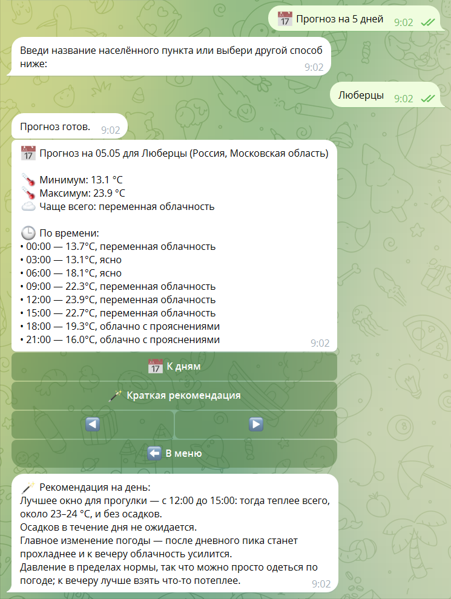
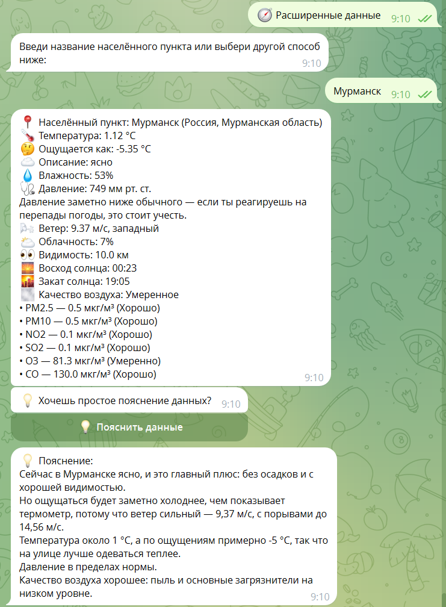
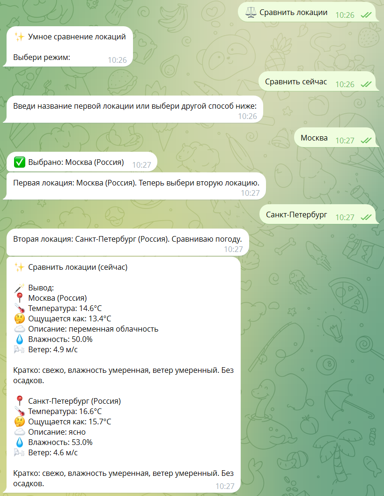
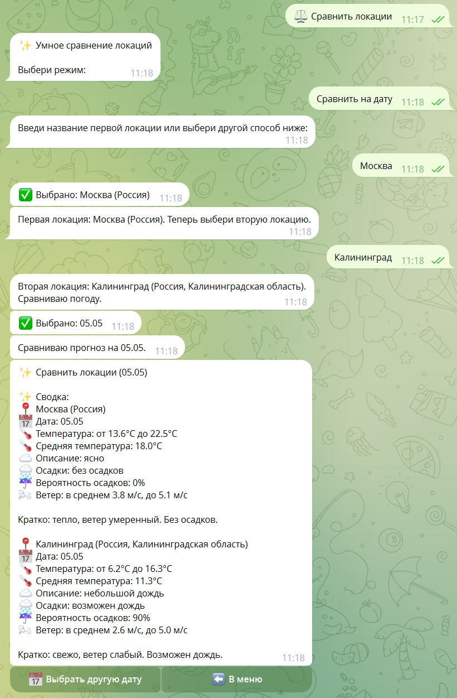
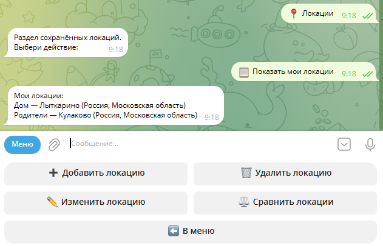
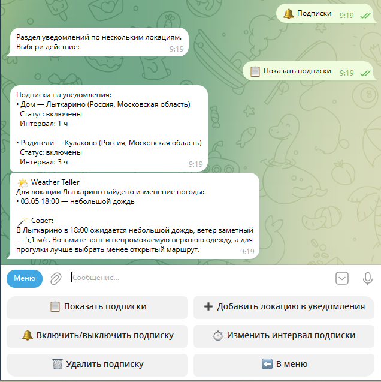
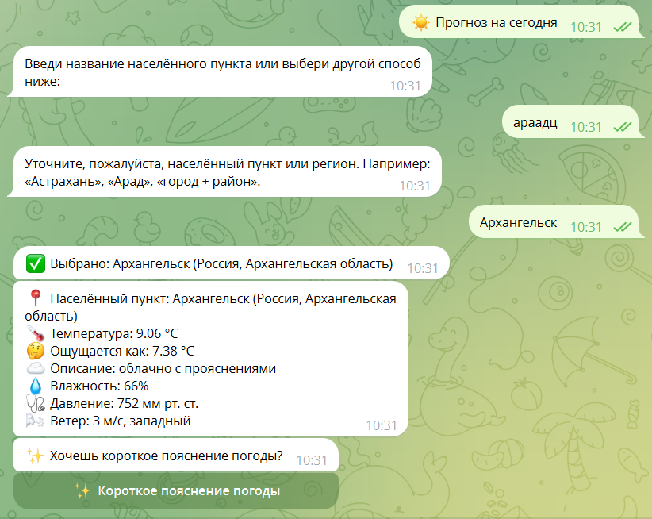

# Weather Teller Telegram Bot

## English Summary

Weather Teller is a Telegram bot for current weather, today and tomorrow forecasts, 5-day forecast, extended weather details, saved locations, location comparison, subscription updates, source comparison, historical weather reference, monthly climate indicators, and short AI explanations. The project combines OpenWeather, Open-Meteo, Open-Meteo Historical Weather API, OpenAI, PostgreSQL, and Docker Compose. It can be run locally with Python for development or through Docker Compose for a closer-to-real deployment flow.

## О проекте

Weather Teller Telegram Bot помогает быстро посмотреть текущую погоду, прогнозы, сравнение локаций, сверку данных из разных погодных источников, архивную справку по погоде и подписки на обновления.

Текущий статус: active beta testing.

Бот ориентирован на понятные ответы в Telegram, аккуратные AI-пояснения и fallback-режимы, когда AI недоступен. Архивная погода показывается как справка по архивным данным, а не как гарантированное наблюдение конкретной метеостанции.

## Возможности

### Главное меню

- `🌦 Прогноз погоды`
- `📍 Локации`
- `🔔 Подписки`
- `ℹ️ Помощь`

### Прогноз погоды

В погодном меню доступны:

- `🌡 Погода сейчас`
- `☀️ Прогноз на сегодня`
- `🌤 Прогноз на завтра`
- `📅 Прогноз на 5 дней`
- `🧭 Расширенные данные`
- `📅 История погоды`
- `🔎 Сравнить источники`

Для текущей погоды, прогнозов и расширенных данных бот умеет показывать короткие AI-пояснения и factual fallback-пояснения, если OpenAI не настроен или временно недоступен.

### Архивная погода

Архивная справка и климатические показатели строятся через Open-Meteo Historical Weather API.

Поддерживается:

- выбор локации текстом;
- выбор через геолокацию;
- выбор сохраненной локации;
- ввод координат;
- быстрые даты: `Вчера`, `7 дней назад`, `30 дней назад`;
- ручной ввод даты в форматах `YYYY-MM-DD`, `YYYY/MM/DD`, `YYYY.MM.DD`, `DD.MM.YYYY`, `DD/MM/YYYY`, `DD-MM-YYYY`, `5 июня 2026`, `5 июн 2026`;
- beta-фича `📊 Средние климатические показатели`.

Внутри beta-фичи доступны два режима:

- `🗓 Месяц конкретного года` — архивная справка за выбранный месяц выбранного года;
- `📆 Среднемесячные показатели` — климатическая справка по архивным данным за период `1991-2020`.

Отчет включает:

- температуру;
- осадки;
- ветер;
- влажность;
- давление;
- погодные условия;
- короткий блок `✨ Коротко` с AI-расшифровкой или fallback-описанием.

Важно:

- это архивная и климатическая справка, а не прогноз;
- для режима `1991-2020` бот явно показывает, что это не прогноз на конкретный месяц;
- в месячных справках используется формулировка `доля дней с осадками по архивным данным`, а не `вероятность осадков`.

History flow в beta-версии уже приведен к общему UX проекта: после выбора локации или даты inline-меню убирается, в чате остается короткое подтверждение выбора, затем приходит результат.

### Сверка источников

Сценарий `🔎 Сравнить источники` показывает данные OpenWeather и Open-Meteo рядом, чтобы можно было посмотреть различия без выбора "лучшего" провайдера.

В коде доступны режимы:

- `🌡 Сейчас`
- `☀️ Сегодня`
- `🌤 Завтра`
- `📅 На дату`

Сверка источников оформляется нейтрально и не подменяет собой обычный прогноз.

### Локации

Раздел локаций поддерживает:

- сохраненные локации;
- добавление по названию города;
- добавление по координатам;
- добавление по геолокации;
- переименование;
- удаление;
- защиту от дублей.

### Сравнение локаций

Бот умеет:

- сравнивать текущую погоду в двух локациях;
- сравнивать прогноз по двум локациям на дату;
- формировать нейтральный вывод без "лучше" и "хуже".

### Подписки

Раздел подписок поддерживает:

- погодные обновления по выбранным или сохраненным локациям;
- интервалы обновлений;
- включение;
- выключение;
- удаление подписок.

## Команды

Фактически зарегистрированные команды:

- `/start`
- `/help`
- `/weather`
- `/current`
- `/tomorrow`
- `/forecast`
- `/geo`
- `/details`
- `/compare`
- `/alerts`
- `/subscriptions`
- `/locations`

Важно:

- отдельной команды `/history` в проекте нет;
- архивная погода доступна через меню `🌦 Прогноз погоды` -> `📅 История погоды`;
- сверка источников доступна через меню `🌦 Прогноз погоды` -> `🔎 Сравнить источники`.

## Стек

- Python
- pyTelegramBotAPI
- Docker Compose
- PostgreSQL
- OpenWeather API
- Open-Meteo API
- Open-Meteo Historical Weather API
- OpenAI API
- pytest

## Структура проекта

Ниже перечислены основные файлы и модули, которые отражают текущее состояние репозитория:

```text
weather_telegram_bot/
├── bot.py
├── flows.py
├── formatters.py
├── keyboards.py
├── app_context.py
├── ai_weather_service.py
├── forecast_service.py
├── weather_history_service.py
├── source_compare_service.py
├── alerts_service.py
├── alerts_subscription_service.py
├── locations_service.py
├── storage.py
├── postgres_storage.py
├── weather_app.py
├── docker-compose.yml
├── docker-compose.postgres.yml
├── .env.example
├── handlers/
│   ├── history.py
│   ├── callbacks_history.py
│   ├── source_compare.py
│   ├── callbacks_source_compare.py
│   ├── locations.py
│   ├── callbacks_locations.py
│   ├── forecast.py
│   ├── details.py
│   └── ...
├── weather/
│   ├── api.py
│   ├── open_meteo.py
│   ├── air_quality.py
│   ├── descriptions.py
│   ├── locations.py
│   └── pressure.py
└── tests/
    ├── test_weather_history_service.py
    ├── test_weather_history_formatter.py
    ├── test_weather_history_flow.py
    ├── test_weather_history_handlers.py
    ├── test_source_compare_service.py
    ├── test_source_compare_formatter.py
    ├── test_source_compare_flow.py
    ├── test_menu_keyboards.py
    ├── test_bot_menu_routing.py
    └── ...
```

## Переменные окружения

Актуальный набор переменных можно посмотреть в `.env.example`.

Основные переменные:

```env
OW_API_KEY=
BOT_TOKEN=
OPEN_METEO_FALLBACK=1
PGHOST=localhost
PGPORT=5432
PGDATABASE=weather_teller
PGUSER=postgres
PGPASSWORD=postgres
OPENAI_API_KEY=
OPENAI_MODEL=gpt-4.1-mini
```

Пояснения:

- `OW_API_KEY` обязателен для сценариев OpenWeather.
- `BOT_TOKEN` обязателен для запуска Telegram-бота.
- `OPEN_METEO_FALLBACK=1` включает fallback на Open-Meteo для current weather, forecast и geocoding, когда это предусмотрено кодом.
- Open-Meteo в этом проекте используется без отдельного API key.
- `OPENAI_API_KEY` опционален. Если он не задан, бот продолжает работать через factual fallback-пояснения.
- `OPENAI_MODEL` задает модель для коротких AI-пояснений.

## Локальный запуск

### Рекомендуемый путь: Docker Compose

```bash
docker compose up -d --build
docker compose ps
docker compose logs -f weather_bot
docker compose down
```

### Запуск только бота после сборки

```bash
docker compose up -d --build weather_bot
docker compose logs -f weather_bot
```

### Запуск через Python для разработки

Если нужен быстрый локальный цикл без контейнеров:

```bash
python bot.py
```

Перед запуском заполните `.env` на основе `.env.example`.

Важно: если используется тот же `BOT_TOKEN`, нельзя одновременно держать production polling и локальный polling. Иначе Telegram может вернуть conflict между двумя процессами.

## Docker Compose

В проекте есть два compose-файла:

- `docker-compose.yml` — основной локальный сценарий с сервисами `postgres` и `weather_bot`;
- `docker-compose.postgres.yml` — отдельный сценарий только для PostgreSQL.

Полезные команды:

```bash
docker compose ps
docker compose logs -f weather_bot
docker compose up -d --build
docker compose up -d --build weather_bot
docker compose down
```

## PostgreSQL

PostgreSQL используется для хранения пользовательских данных и AI cache.

Актуальные таблицы:

- `users`
- `saved_locations`
- `alert_subscriptions`
- `ai_response_cache`

На текущем этапе для history flow и source compare не добавлялись отдельные таблицы. Архивная погода и сверка источников работают через сервисы и существующую инфраструктуру приложения.

## Тесты и проверки

Основные команды проверки:

```bash
python -m pytest
python -m compileall .
rg "ё|Ё"
```

Что уже покрыто тестами:

- меню и routing;
- weather history service;
- weather history formatter;
- weather history flow;
- weather history handlers;
- source compare service;
- source compare formatter;
- source compare flow;
- date parsing;
- error paths для history и fallback-сценариев Open-Meteo.

## Скриншоты

В репозитории уже есть такие изображения:

- `screenshots/01_main_menu.png`
- `screenshots/02_current_weather_ai.png`
- `screenshots/03_tomorrow_forecast_ai.png`
- `screenshots/04_forecast_5days.png`
- `screenshots/05_extended_data_ai.png`
- `screenshots/06_compare_current.png`
- `screenshots/07_compare_by_date.png`
- `screenshots/08_saved_locations.png`
- `screenshots/09_weather_subscription_ai.png`
- `screenshots/10_location_clarification.png`

Текущий набор:












### Рекомендуемые скриншоты для обновления

Пока без broken image links стоит добавить в следующем обновлении README:

- history flow с выбором даты;
- history result с блоками `🌡`, `🌧`, `💨`, `📊`, `🤖`;
- source compare для режима `Сейчас`;
- source compare для режима `На дату` или `Завтра`.

## Roadmap

### Near-term

- beta wording polish и cleanup пользовательских текстов;
- дополнительная полировка history UX там, где это нужно после smoke-test;
- сценарий "выбрать другую дату" для той же history-локации без повторного ввода;
- voice input как отдельный следующий этап, без смешивания с текущими weather flows.

### Later

- TTS и голосовой вывод;
- более широкий климатический контекст там, где это действительно полезно;
- дополнительные погодные провайдеры;
- наблюдаемость, логи и monitoring для beta-эксплуатации.

## Примечания

- OpenWeather и Open-Meteo могут отличаться по расчетным моделям и таймзонам, поэтому сверка источников показывает данные рядом, а не пытается выбрать "правильный" ответ.
- Архивная погода описывает примерную картину дня по архивным данным Open-Meteo.
- AI-пояснения короткие и необязательные: при недоступности OpenAI бот должен оставаться полезным и без них.
